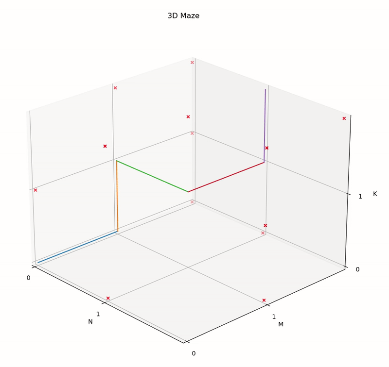
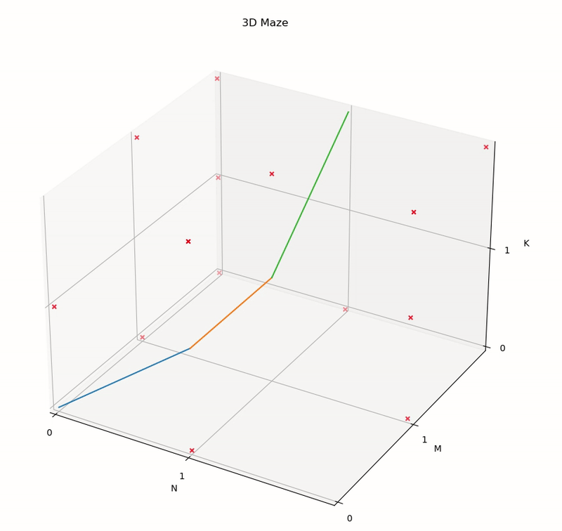
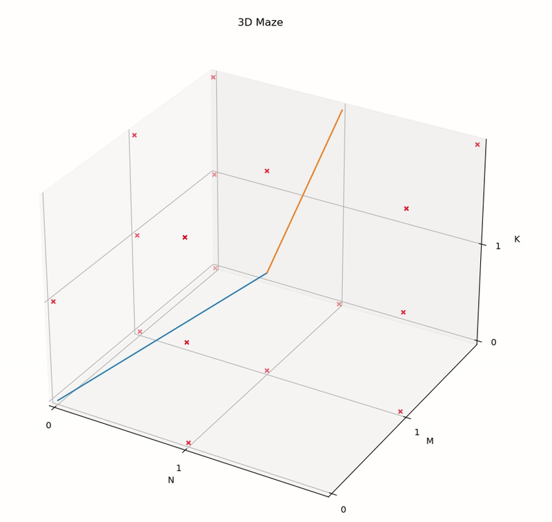

# 3DPathFinder 


Path finder algorithm finds the shortest path from a start cell to a stop cell.

This program uses the [dijkstra](https://en.wikipedia.org/wiki/Dijkstra%27s_algorithm) algorithm to traverse the 3D matrix in search of the shortest path. To do this, it uses the [dijkstra3d](https://pypi.org/project/dijkstra3d/) package which, by using the distance from target as a heuristic (A* search), returns the best option. 

The program has the ability to check the validity of the inputs and return an answer only if it is possible to find an optimal path without passing through obstacles in the maze.

## Table Of Content

- [Problem Description](#problem-description)
    - [Challenge](#challenge)
    - [Dijkstra algorithm](#dijkstra-algorithm)
- [dijkstra3d package](#dijkstra3d-package)
- [Installation](#installation)
    - [Installation in anaconda](#installation-in-anaconda)
    - [Package requirements](#package-requirements)
    - [Download the code](#download-the-code)
- [Program use](#program-use)
    - [Parameter configuration](#parameter-configuration)
    - [Optimal path](#optimal-path)
    - [Visualization](#visualization)
 - [Examples of visualization](#examples-of-visualization)
- [License](#license)
- [Links](#links)


## Problem Description 

### Challenge


The problem consists of a 3D grid of size (N x M x K).

Within the grid each node can be either an empty cell, noted as 0 or an obstacle, noted as 1.

The objective is to find the shortest possible path from the start cell to the stop cell in the grid given its coordinates (e. g., start = [0, 0, 0], end = [N-1, M-1, K-1]).

### Dijkstra algorithm


## dijkstra3d package

To find the most optimal path, 3DPathFinder uses the package [dijkstra3d](https://pypi.org/project/dijkstra3d/). 

## Installation

3DPathFinder has been tested in an [anaconda](https://www.anaconda.com/) environment with *python 3.9.16*.

### Installation in anaconda

Create a new environment in anaconda with *python=3.9.16*:

```bash
conda create --name pathfinder python=3.9.16
```

Activate the new environment:

```bash
conda activate pathfinder
```

### Download the code

To install 3DPathFinder you can download the program from its GitHub repository as follows:

```bash
git clone https://github.com/nucontreras/3d-maze.git
```

Open the 3DPathFinder folder from the terminal 

```bash
cd 3d-maze
```

### Package requirements

To use the program it is necessary to install the following packages using pip : 

```txt
matplotlib==3.5.3
numpy==1.23.5
dijkstra3d==1.12.0
```

Execute the following line of code in the command line:

```bash
pip install -r requirements.txt
```

You have everything installed to be able to use the program.

## Program use

### Parameter configuration

### Optimal path

### Visualization


## Examples of visualization

For the following three cases, the first image of each example uses the algorithm looking for possible paths considering only the faces of a voxel in the 3D matrix. The second image considers a connectivity of type faces and edges, i.e. diagonal movements within the same face. Finally, the third one considers faces, edges and corners, i.e. all diagonal movements from a node, including diagonal movements in 3D.

### Maze 3x3x3
<p float="left">
  
   
   
</p>

### Maze 3x5x9
<p float="left">
  
   
   
</p>

### Maze 40x50x60
<p float="left">
  
   
   
</p>


## License

The 3DPathFinder is licensed under the terms of the GNU General Public License
license and is available for free.

## Links
* [Challenge description](https://ipick.notion.site/Multidimensional-Maze-751dd3ef642748d38606af0add166319)
* [dijkstra3d](https://pypi.org/project/dijkstra3d/)
